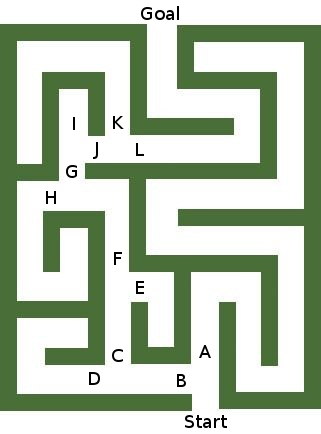

Chapter 3 deals mainly with informed search methods, greedy algorithms, and
heuristics. The methods detailed in this chapter contrast with those in the
last chapter because they tend to focus less on finding an optimal solution,
and more on finding *a* solution in a shorter time, or using less memory.
Such algorithms are important when it is *not possible* to find the optimal
solution in an acceptible amount of time, such as is the case in games like
chess, or real world AI.


# Questions for discussion

2. **Explain why hill climbing would be classified as a greedy algorithm.**

    Hill climbing is a greedy algorithm, because at each step in the search
    for a solution, the first path which brings the climber closer to the goal
    state than the current is chosen. It is very greedy in that it doesn't even
    consider all of its choices for the next move, and takes the very first
    path which improves its state. There is no backtracking allowed, so it is
    entirely possible that the goal state, or the global maximum, is never
    reached. A local maximum, however, will be reached for certain.

3. **Explain how steepest-ascent hill climbing can also provide an optimal
   solution.**

    Steepest-ascent hill climbing has the advantage over simple hill climbing
    of considering all of its choices at a given step, and selecting the one
    which brings it closer to the goal state, instead of choosing the very
    first one which improves on the current state. Like simple hill climbing,
    it will converge on a local maximum, though it does so in a less greedy
    manner. The local maximum *can* also be a global maximum, though the
    method makes no distinction. The only time either method would be
    guaranteed to find the global maximum is when there is only a single
    maximum.

4. **Why is it that the best-first search is more effective than hill
   climbing?**

    Best-first search has the advantage over hill climbing that it will always
    converge to a solution if one exists. It still might not find the optimal
    path to the solution. A best-first search may find a local maximum, but if
    that does not satisfy the goal state, it will backtrack and traverse other
    nodes until it finds the global maximum.

5. **Explain how beam search works.**

    Beam search is a more memory-limited form of best-first search. Like
    best-first search, it looks at some heuristic measure of the transition
    nodes, and first expands the one which has the best score. Unlike
    best-first search, it has a limit on the number of transition nodes it will
    consider from a given node, called the *beam width*. So if the beam width
    is 2, only the 2 best transitions from each node will be expanded. If the
    beam width is infinite, then it becomes best-first search. By imposing this
    beam width limitation, it becomes possible for the goal state to be
    rendered un-reachable, and so not only does it not guarantee an optimal
    solution, but it doesn't even guarantee a solution whatsoever. This,
    however, is the cost paid for memory conservation.

6. **What does it mean for a heuristic to be admissible?**

    A heuristic is admissible if it does not overestimate the distance to the
    goal state. The point of a heuristic is not to find the shortest path to
    the goal, but instead to find a path which eventually reaches the goal in
    a reasonable amount of time. If a heuristic's estimate of distance was
    perfect, then it would hardly be a heuristic at that point. If it
    overestimates the distance, then there may be a point in the search where
    the optimal path is intentionally avoided because its distance was
    overestimated.


# Exercises

1. **Give three examples of heuristics and explain how they play a significant
   role in**

    a. **your day-to-day life, and**

    b. **the problem-solving process for some challenge that faces you.**

        i. The banana ripeness heuristic:

            ```python
            if the banana is partially green:
                wait to eat it
            else if the banana is mostly brown:
                check that the inside is not completely rotten before eating it
            else if the banana is completely black:
                throw it away without hesitation
            ```
           
             This heuristic has helped me in my day-to-day fight against
             hunger, as well as my overall happiness level. By waiting until a
             banana is no longer green, I end up eating a tastier banana, and
             my happiness increases. By avoiding eating completely rotten
             bananas, I avoid sickness.

             Each day I face the challenge of deciding whether my bananas are
             fit for consumption. This heuristic which I have developed through
             experience helps reduce the time I spend questioning whether I
             should eat a particular banana, and saves me from eating a banana
             at the wrong time.

        ii. The jacket heuristic:

            ```python
            if the skies are overcast:
                wear a rain jacket
            else if it is cold outside:
                wear a regular jacket or coat
            else:
                wear no jacket
            ```

             This heuristic has helped me avoid wetness and coldness in my
             day-to-day life. It has helped me to decide when to wear a jacket
             for warmth or dryness, and when to leave my jacket at home. The
             weather is unpredictable, so it does not always work, but it has
             certainly helped.

             Dressing properly has helped me in the challenge of survival in
             harsh weather, where I might freeze to death or contract
             pneumonia if I leave home without a jacket.

        iii. The light heuristic:

            ```python
            if a light is on, and it is not being used:
                turn it off
            ````

             This heuristic has helped me reduce my energy usage each day.
             Each day it has reduced my negative impact on the environment.

             This heuristic has aided in solving the challenge of paying
             power bills. It has probably saved me several dollars in total.

2. **Explain why hill climbing is called a "greedy algorithm."**

    Hill climbing is called a greedy algorithm because at each step it makes
    the locally optimal choice. It does not necessarily converge to a global
    maximum, but it will find a local maximum, which may or may not be close
    to the global one, but will likely be found in a shorter time.

    a. **Describe some other algorithms that you know that are "greedy."**

        One famous greedy algorithm is Prim's Algorithm, which finds a
        minimal spanning tree of a graph. Another is Kruskal's algorithm,
        which can not only find the minimal spanning tree, but also the
        minimal spanning *forest*.

    b. **Explain how steepest-ascent hill climbing is an improvement over
       simple hill climbing.**

        Steepest-ascent hill climbing improves over simple hill climbing in
        that it actually weighs all options at a given node, instead of
        choosing the first one which improves over the current node. It is
        still subject to the same pitfalls, but it has a better chance of
        finding a greater local maximum, even if it is not the global maximum.

    c. **How does the best first search improve over hill climbing?**

        Best first search, unlike hill climbing, has the ability to
        backtrack. It will not settle for a local maximum, and will traverse
        the entire tree until it reaches a global maximum if it needs to. Of
        course, it does not *have* to search the entire tree, as it knows to
        stop once the goal is met. Still, it will not attempt to take the most
        optimal path to the goal, and will simply stop once it finds *any*
        path to the goal.

\setcounter{enumi}{5}

6. **Consider the following variation of the n-Queens Problem:**

    **If some of the squares that would be attacked by the placement are
    obstructed by the placement of pawns on an n x n chessboard, can more than
    n-Queens be placed on the partial board that remains? For example, if five
    pawns are added to a 3 x 3 chessboard, then four nonattacking Queens may be
    placed on the board (Figure 3.30).**

    As Figure 3.30 suggests, there do exist values of $n$ such that an
    $n \times n$ chess board can contain $m > n$ non-attacking queens.
    However, this is not true for all values of $n$. Take for instance the
    simplest case: a $2 \times 2$ board. It is impossible to even place $2$
    queens on such a board without them attacking, as they must always be
    touching. However, this is an unfair example, as the question states that
    the pawns must obstruct the queens' attacks, which is not possible on a $2
    \times 2$ board.

    If we raise the size to $4 \times 4$, then we have a fair
    counter-example. On such a board, it is impossible to place more than 4
    non-attacking queens, because if we put 2 queens in the same row or column,
    no queen can be placed in the adjacent row or column, as they would have to
    touch one of the 2 queens. This means that there can either be two rows or
    columns with two queens in them, one row or column with two queens while
    another two have single queens, or all rows and columns must have a single
    queen in them. In all cases this limits us to 4 queens. So in general,
    an $n \times n$ chess board cannot have $m > n$ queens, although certain
    values of $n$ allow it.

\setcounter{enumi}{7}

8. **Develop an admissible heuristic to solve the Maze Problem from Chapter 2
   (Exercise 13).**

    The most obvious admissible heuristic to use is the Euclidean distance, or
    "ordinary" distance to the goal. This is the distance which assumes one can
    travel in a straight line to the goal, despite it not always being
    possible. So if $\vec{r}$ is the separation vector between the player and
    the goal, the magnitude of that vector
    $|\vec{r}| = \sqrt{r_x^2 + r_y^2}$
    is the euclidean distance to the goal. The heuristic would be defined as
    $h(\vec{r}) = |\vec{r}|$.

    a. **Employ your heuristic to conduct an A* search to solve this problem.**

        First I have labeled all forks in the maze with the letters A-L.

        

        Using an A* search with my heuristic, the paths chosen are described by
        the following graph. Note that if 2 nodes are at the same depth, they
        are visited in an order which follows the colors of the rainbow, so red
        is visited first, then orange, and so on.

        \begin{figure}[H]
          \centering
          \includegraphics[width=0.5\textwidth]{img/a3e8_a.eps}
        \end{figure}

\setcounter{enumi}{11}

12. **In Chapter 2 we presented the n-Queens Problem. Write a program to solve
    the Eight-Queens Problem by applying constraints that remove any row or
    column from consideration once a queen has been placed.**

```clojure
#!/usr/bin/env lein-exec

;; Clojure program which iteratively finds the first solution to the ;;
;; 8-Queens problem using the constraints of Chapter 3 Exercise 12.  ;;

(defn abs-difference [x y]
  "Finds the absolute value of the difference between two sequences."
  (map #(Math/abs (- %1 %2)) x y))

(defn diagonal-clash? [taken pair]
  "Returns true if the given pair clashes diagonally with any of the taken
  pairs by checking if the abs-difference between the pair and any taken pair
  is the same.

  Examples:
  [1 1] and [2 2] clash because |1-2| == |1-2|
  [0 1] and [1 2] clash because |0-1| == |1-2|"
  (some true?
        (for [taken-pair taken]
          (apply = (abs-difference taken-pair pair)))))

(defn find-solution-iter [rows cols taken]
  "Recursively finds the first found sets of solution pairs to the 8-queens
  problem."
  (some identity
        (for [r rows, c cols,
              :let [pair [r c]]]
          (when-not (diagonal-clash? taken pair)
            (let [rows  (disj rows  r)
                  cols  (disj cols  c)
                  taken (conj taken pair)]
              (if (and (seq rows)
                       (seq cols))
                (find-solution-iter rows cols taken)
                taken))))))

(defn find-solution []
  "Finds a set of solution pairs to the 8-queens problem by calling a
  recursive function which searches over rows 0-7 and cols 0-7."
  (let [rows      (set (range 8))
        cols      (set (range 8))
        solution (find-solution-iter rows cols #{})]
    solution))

(defn print-solution [solution]
  "Print the solution, with X's marking queens and -'s marking empty spaces."
  (when (seq solution)
    (doseq [r (range 8)]
      (doseq [c (range 8)]
        (if (solution [r c])
          (print "X ")
          (print "- ")))
      (print "\n"))))

;; Print the first solution found
(print-solution (find-solution))
;; Output
;
; X - - - - - - - 
; - - - - X - - - 
; - - - - - - - X 
; - - - - - X - - 
; - - X - - - - - 
; - - - - - - X - 
; - X - - - - - - 
; - - - X - - - -
;
```
